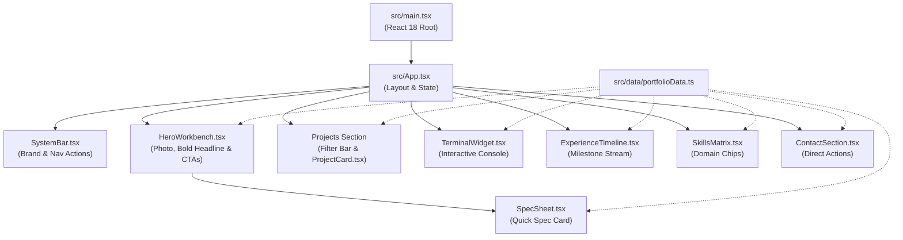

# Architecture & Technical Organization — React (Vite)

## 1. Architectural Philosophy
The portfolio is architected as a high-performance single-page web application using **React 18**, **Vite**, and **TypeScript**.
- **Modern Standards Core**: Native HTML5 semantic tags (`<header>`, `<nav>`, `<main>`, `<section>`, `<article>`, `<aside>`, `<footer>`), styled via native Vanilla CSS custom properties (`tokens.css`).
- **Lightning-Fast Toolchain**: Powered by Vite and ES modules for instant hot module replacement (HMR) and optimized static production builds.
- **Decoupled Data Architecture**: All portfolio records (projects, experience, skills, specs) reside in `src/data/portfolioData.ts`, cleanly separating content data from presentation components.

---

## 2. Directory Structure & File Hierarchy

```
portfolio/
├── index.html                  # Core single-page HTML5 entrypoint
├── vite.config.ts              # Vite bundler configuration
├── package.json                # Project dependencies & scripts
├── tsconfig.json               # TypeScript compiler options
├── src/
│   ├── main.tsx                # React 18 createRoot entrypoint
│   ├── App.tsx                 # Main application layout & filter coordinator
│   ├── styles/
│   │   ├── tokens.css          # CSS Custom Properties (Colors, Typography, Spacing)
│   │   └── index.css           # Global resets, base typography, and utilities
│   ├── data/
│   │   └── portfolioData.ts    # Single source of truth for projects, skills, timeline
│   ├── components/
│   │   ├── SystemBar.tsx       # Top identity & live status banner
│   │   ├── HeroWorkbench.tsx   # Photo frame, bold headline, and CTAs
│   │   ├── SpecSheet.tsx       # Technical telemetry register card
│   │   ├── ProjectCard.tsx     # Asymmetric card with architecture & metrics
│   │   ├── TerminalWidget.tsx  # Interactive command console emulator
│   │   ├── ExperienceTimeline.tsx # Vertical milestone guideline
│   │   ├── SkillsMatrix.tsx    # Categorized skill chips
│   │   └── ContactSection.tsx  # Utilitarian contact register
│   └── types/
│       └── declarations.d.ts   # Static asset module declarations (*.jpg, *.png)
├── assets/
│   ├── profile.jpg             # User profile picture
│   └── docs/                   # Candidate resume
├── Dark.md                     # Dark-mode design system reference
├── Light.md                    # Light-mode design system reference
├── PRD.md                      # Product Requirements Document
├── Architecture.md             # Technical organisation & structure (this file)
├── rules.md                    # Operational constraints & development rules
├── phases.md                   # Multi-stage implementation roadmap
├── design.md                   # Visual design system & token definitions
└── memory.md                   # Project state tracking & context memory
```

---

## 3. Component Architecture & Data Flow



---

## 4. Styling Architecture & Design Token Pipeline
Styling is maintained via CSS custom properties defined in `src/styles/tokens.css`:
- **Colors**: `--color-primary: #D97706;`, `--surface-canvas: #0F172A;`, `--surface-subtle: #1E293B;`, `--surface-elevated: #334155;`
- **Typography**: `Geist` (Sans) for headlines and prose, `JetBrains Mono` for metadata, tags, and terminal.
- **Elevation**: Flat 1px structural borders paired with hard 2px non-diffuse offset shadows (`box-shadow: 2px 2px 0px 0px #000000`).
