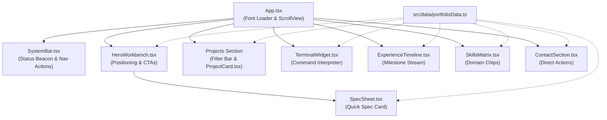

# Architecture & Technical Organization — React Native

## 1. Architectural Philosophy
The portfolio is architected as a cross-platform application using **React Native**, powered by the **Expo** ecosystem and **React Native Web**.
- **Unified Cross-Platform Core**: One cohesive TypeScript codebase targeting Web browsers, Android, and iOS without maintaining separate web and native codebases.
- **Component-Driven Primitives**: Built strictly with React Native primitives (`View`, `Text`, `Pressable`, `ScrollView`, `TextInput`, `SafeAreaView`) styled via typed `StyleSheet` modules.
- **Decoupled Data Architecture**: All portfolio records (projects, experience, skills, specs) are housed in pure data modules (`src/data/`), enabling clean separation of data and rendering logic.

---

## 2. Directory Structure & File Hierarchy

```
portfolio/
├── App.tsx                     # Application root, font provider, theme container
├── app.json                    # Expo project configuration
├── package.json                # Project dependencies & scripts
├── tsconfig.json               # TypeScript compiler options
├── src/
│   ├── theme/
│   │   ├── tokens.ts           # Design tokens (Colors, Typography, Spacing, Borders)
│   │   └── types.ts            # Type definitions for design system
│   ├── data/
│   │   └── portfolioData.ts    # Single source of truth for projects, skills, timeline
│   ├── components/
│   │   ├── SystemBar.tsx       # Top identity & live status banner
│   │   ├── HeroWorkbench.tsx   # Headline & technical positioning
│   │   ├── SpecSheet.tsx       # Quick technical specifications card
│   │   ├── ProjectCard.tsx     # Asymmetric project card with architecture & metrics
│   │   ├── TerminalWidget.tsx  # Interactive command console emulator
│   │   ├── ExperienceTimeline.tsx # Vertical milestone guideline
│   │   ├── SkillsMatrix.tsx    # Categorized skill chips
│   │   └── ContactSection.tsx  # Utilitarian contact register
│   └── utils/
│       └── responsive.ts       # Viewport breakpoint hooks & responsive helpers
├── assets/
│   ├── icons/                  # SVG icons and asset images
│   └── docs/                   # Candidate resume
├── Dark.md                     # Dark-mode design system reference
├── Light.md                    # Light-mode design system reference
├── PRD.md                      # Product Requirements Document
├── Architecture.md             # Technical organisation & structure (this file)
├── rules.md                    # Operational constraints & development rules
├── phases.md                   # Multi-stage implementation roadmap
├── design.md                   # Visual design system & token definitions
└── memory.md                   # Project state tracking & context memory
```

---

## 3. Component Architecture & Data Flow



---

## 4. Styling & Design Token Pipeline
Instead of CSS stylesheets, styling is managed through a typed `tokens.ts` module consumed by React Native's `StyleSheet.create()`:

```typescript
// src/theme/tokens.ts
export const theme = {
  colors: {
    primary: '#D97706',          // Electric industrial amber
    secondary: '#0F172A',        // Deep obsidian slate
    tertiary: '#475569',         // Cool slate
    neutral: '#FAFAF9',          // Technical off-white
    surfaceCanvas: '#0F172A',    // Background canvas
    surfaceSubtle: '#1E293B',    // Card module backgrounds
    surfaceElevated: '#334155',  // Sidebar panels, elevated cards
    surfaceDeep: '#0C0F0E',      // Terminal background well
    borderStructural: '#334155', // Standard 1px divider
    borderProminent: '#64748B',  // Container frame
    statusSuccess: '#059669',    // Live/online indicator
    statusWarning: '#D97706',    // WIP/Beta indicator
    statusError: '#DC2626'       // Error indicator
  },
  spacing: {
    xs: 8,
    sm: 12,
    md: 16,
    lg: 24,
    xl: 32,
    '2xl': 48
  },
  radii: {
    sm: 4,
    md: 8,
    lg: 12
  }
};
```

---

## 5. Responsive Layout Architecture
To ensure the 12-column asymmetric layout renders properly on desktop web while stacking smoothly on mobile:
- **`useWindowDimensions()`**: Dynamic hook tracking screen width.
- **Breakpoints**:
  - Desktop (`width >= 1024`): Two-column asymmetric layouts (Hero + SpecSheet, Project Grid, Terminal Side-by-Side).
  - Tablet (`768 <= width < 1024`): Condensed 2-column or stacked layout.
  - Mobile (`width < 768`): Single column stacked layout with 100% width cards.
- **Max Container Constraint**: Content constrained to `maxWidth: 1152` (72rem) and centered with `alignSelf: 'center'`.

---

## 6. Terminal Engine State Machine
The embedded terminal emulator operates as a self-contained React Native state machine:
```typescript
interface CommandEntry {
  command: string;
  output: string | string[];
  timestamp: string;
}
```
State holds an array of `CommandEntry` items rendered inside an auto-scrolling `ScrollView`. Commands dispatch through a pure mapping object, returning pre-compiled text outputs or triggering actions (e.g. copying email or scrolling to sections).
