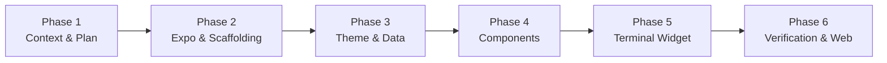

# Implementation Phases & Project Roadmap — React Native

This roadmap details the sequential phases for building, refining, and testing the **React Native** Technical Blueprint portfolio.

---

## Roadmap Overview

---

## Phase Breakdown

### Phase 1: Context Engineering & Alignment (Status: Completed)
- [x] Initialized all 6 context files based on course standard.
- [x] Approved implementation plan for React Native migration.
- [x] Updated `PRD.md`, `Architecture.md`, `rules.md`, `phases.md`, `design.md`, and `memory.md` for React Native.

---

### Phase 2: React Native (Expo) Project Scaffolding (Status: In Progress)
- [ ] Initialize Expo package configuration (`package.json`, `app.json`, `tsconfig.json`).
- [ ] Install React Native, Expo, and React Native Web dependencies.
- [ ] Establish root `App.tsx` and directory structure (`src/components/`, `src/theme/`, `src/data/`, `src/utils/`).
- **Verification Gate**: TypeScript compiles cleanly; development server launches without errors.

---

### Phase 3: Theme Tokens & Data Layer (Status: Pending)
- [ ] Implement `src/theme/tokens.ts` mapping all colors, spacing, and typography from `Dark.md`.
- [ ] Implement `src/theme/types.ts` for type-safe theme consumption.
- [ ] Implement `src/data/portfolioData.ts` with developer profile, featured projects, benchmarks, experience timeline, and skills.
- **Verification Gate**: Design tokens strictly match `Dark.md` hex codes and values.

---

### Phase 4: Core Presentation Components (Status: Pending)
- [ ] Implement `SystemBar.tsx`: Identity banner, live status beacon, resume link.
- [ ] Implement `HeroWorkbench.tsx`: Technical positioning headline and action row.
- [ ] Implement `SpecSheet.tsx`: Monospace quick-spec card.
- [ ] Implement `ProjectCard.tsx`: Asymmetric layout with metadata strip, architecture notes, benchmarks, and stack tags.
- [ ] Implement `ExperienceTimeline.tsx`: Vertical guideline with square node markers and monospace timestamps.
- [ ] Implement `SkillsMatrix.tsx`: Categorized skill chips with subtle borders.
- [ ] Implement `ContactSection.tsx`: Direct contact actions with clipboard copy alerts.
- **Verification Gate**: Components render with high visual density and 7:1 text contrast.

---

### Phase 5: Interactive Terminal Console Widget (Status: Pending)
- [ ] Implement `TerminalWidget.tsx`:
  - Command input parsing (`help`, `about`, `projects`, `skills`, `contact`, `clear`).
  - Scrollable terminal output buffer.
  - Suggestion chips for quick touch/tap command execution.
- **Verification Gate**: All commands execute properly and produce formatted output.

---

### Phase 6: Responsive Layout, Testing & Optimization (Status: Pending)
- [ ] Verify fluid responsiveness across Desktop (>=1024px) 12-column layout, Tablet (768px-1023px), and Mobile (<768px) views.
- [ ] Audit keyboard accessibility and touch targets (minimum 44x44px for primary interactions).
- [ ] Verify Web preview via `react-native-web`.
- **Verification Gate**: Type check passes (`tsc --noEmit`), app builds cleanly, and UI passes visual verification.
