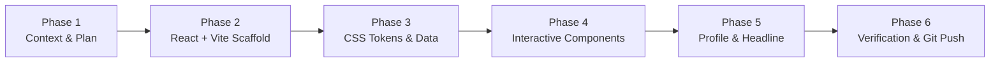

# Implementation Phases & Project Roadmap — React (Vite)

This roadmap details the sequential phases for building, refining, and testing the **React 18 + Vite** Technical Blueprint portfolio.

---

## Roadmap Overview

---

## Phase Breakdown

### Phase 1: Context Engineering & Alignment (Status: Completed)
- [x] Initialized all 6 context files based on course standard.
- [x] Approved implementation plan for React (Vite) transition.
- [x] Synchronized `PRD.md`, `Architecture.md`, `rules.md`, `phases.md`, `design.md`, and `memory.md`.

---

### Phase 2: React 18 + Vite Scaffolding (Status: Completed)
- [x] Configured `package.json` with React 18, React-DOM, and Vite 6.
- [x] Configured `vite.config.ts` and `tsconfig.json` for React JSX and asset imports.
- [x] Configured `index.html` with Google Fonts (`Geist`, `JetBrains Mono`) and `#root` container.
- [x] Installed dependencies cleanly (`npm install`).

---

### Phase 3: CSS Tokens & Data Layer (Status: Completed)
- [x] Implemented `src/styles/tokens.css` mapping all colors, spacing, and typography from `Dark.md`.
- [x] Implemented `src/styles/index.css` with reset, layout grid, buttons, badges, and terminal styles.
- [x] Preserved and verified `src/data/portfolioData.ts` with developer profile, featured projects, benchmarks, experience timeline, and skills.

---

### Phase 4: Interactive React Component Library (Status: Completed)
- [x] `SystemBar.tsx`: Identity banner, live system beacon, GitHub & LinkedIn links.
- [x] `SpecSheet.tsx`: Monospace quick-spec card with core competencies and metrics.
- [x] `ProjectCard.tsx`: Asymmetric layout with metadata strip, architecture notes, benchmarks, and stack tags.
- [x] `TerminalWidget.tsx`: Interactive command console with autocomplete suggestion chips.
- [x] `ExperienceTimeline.tsx`: Vertical guideline with square node markers and monospace timestamps.
- [x] `SkillsMatrix.tsx`: Categorized skill chips with subtle borders.
- [x] `ContactSection.tsx`: Direct contact actions with one-click clipboard copy.

---

### Phase 5: Profile Photo & Developer Branding (Status: Completed)
- [x] Installed `assets/profile.jpg` in high-contrast frame with verified telemetry indicator.
- [x] Implemented bold uppercase headline **BISWA PRAKASH MOHANTY** in `HeroWorkbench.tsx`.

---

### Phase 6: Build Verification & Git Repository Synchronization (Status: In Progress)
- [x] Verified production build (`npx vite build` executed with 0 errors).
- [ ] Stage all modified and untracked files in Git.
- [ ] Create Git commit with descriptive message.
- [ ] Push all commits to GitHub repository: `https://github.com/biswaprakashmohanty324-blip/portfolio-.git`.
